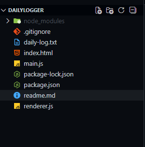

# DailyLogger 📝🚀

DailyLogger is a simple personal desktop application built with **Electron + Node.js** that helps you maintain a **daily developer log** and automatically commit meaningful updates to a GitHub repository.

Instead of fake or automated commits, this tool encourages **real daily reflection**:
- What you learned today
- What you built or explored
- What you plan to do next

Your GitHub contribution graph stays green **naturally**, backed by real content.

---

## ✨ Why DailyLogger?

Many developers want to:
- Stay consistent with daily learning
- Build a habit of reflection
- Keep their GitHub activity active in an honest way

DailyLogger solves this by turning your **daily notes into real Git commits**.

No gimmicks. No fake scripts. Just real progress.

---

## 🧠 Philosophy

> “If it’s on GitHub, it should mean something.”

Every commit created by DailyLogger represents:
- A real learning session
- A real thought
- A real day of progress

If someone inspects your commits, they’ll find **actual notes**, not noise.

---

## 🛠 Tech Stack

- **Electron** – Desktop application framework
- **Node.js** – Runtime environment
- **simple-git** – Git automation from Node
- **HTML / CSS / JavaScript** – UI layer

---

## 📦 Features

- 🖥 Simple desktop GUI
- ✍️ Write daily learning logs
- 📂 Automatically append logs to a file
- 🔁 Git add → commit → push (one click)
- 📈 Keeps GitHub contribution graph active
- 🧘 Minimal and distraction-free

---

## 📂 Project Structure



---

## 🚀 Getting Started

### 1️⃣ Clone the repository
```bash
git clone <your-repo-url>
cd dailylogger
npm install
npx electron .
```


---

## 📝 How It Works

1. Open DailyLogger
2. Write what you achieved or learned today
3. Click Save & Commit

That's it.


## 🙌 Personal Note

DailyLogger was built as a personal productivity tool first.
If it helps others build better habits — that’s a bonus.

Feel free to fork, modify, or adapt it to your own workflow.


## 📜 License

MIT License – use it, modify it, learn from it.


Happy logging ✨
Build. Learn. Commit.
